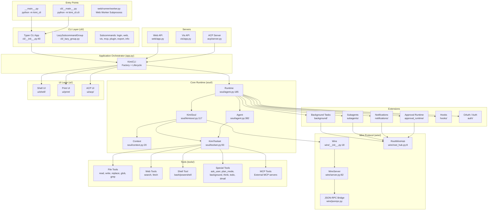

# Kimi CLI Architecture Overview

> Source analyzed: `/Users/rg/Projects/kimi-cli/src/kimi_cli`

## 1. High-Level Component Diagram



## 2. Layered Architecture

```mermaid
flowchart TB
    subgraph Layer4["Presentation Layer"]
        direction TB
        Shell["Interactive Shell (prompt_toolkit + Rich)"]
        Print["Print Mode (stdin/stdout)"]
        WebUI["Web UI (FastAPI + WebSocket)"]
        VisUI["Vis UI (FastAPI static SPA)"]
        ACPCli["ACP Client / MCP Host"]
    end

    subgraph Layer3["Application Layer"]
        direction TB
        KimiCLI["KimiCLI (app.py)"]
        SessionMgr["Session Manager (session.py)"]
        ConfigMgr["Config Manager (config.py)"]
    end

    subgraph Layer2["Domain Layer (Agent Core)"]
        direction TB
        KimiSoul["KimiSoul (soul/kimisoul.py)"]
        Agent["Agent (soul/agent.py)"]
        Context["Context (soul/context.py)"]
        Toolset["KimiToolset (soul/toolset.py)"]
    end

    subgraph Layer1["Infrastructure Layer"]
        direction TB
        Wire["Wire Protocol"]
        LLM["LLM Provider (kosong)"]
        Kaos["Kaos FS / Process"]
        OAuth["OAuth Manager"]
        Store["Disk Stores (metadata, state, wire)"]
    end

    Layer4 <-->|WireMessage| Layer3
    Layer3 -->|run_soul()| Layer2
    Layer2 -->|ChatProvider| Layer1
    Layer2 -->|Tool Calls| Layer1
    Layer3 -->|Session/Config I/O| Layer1
```

## 3. Key Directory Responsibilities

| Directory | Responsibility |
|-----------|----------------|
| `cli/` | Typer-based command-line interface, lazy-loaded subcommands |
| `app.py` | `KimiCLI` factory and run-mode dispatch (shell/print/acp/wire) |
| `session.py` | Session lifecycle: create, find, list, continue, delete |
| `soul/` | Agent execution engine: KimiSoul, context, toolset, runtime |
| `wire/` | Internal message protocol between soul and UI |
| `tools/` | Tool implementations: file, shell, web, special tools |
| `ui/` | UI implementations: shell, print, acp |
| `background/` | Background bash/agent task management |
| `subagents/` | Subagent registry, builder, runner, store |
| `notifications/` | Notification publish/delivery/ack system |
| `approval_runtime/` | Approval request/response routing |
| `hooks/` | Event-driven shell-command hooks |
| `auth/` | OAuth device flow and token refresh |
| `web/` | FastAPI web UI backend with worker subprocess model |
| `vis/` | FastAPI visualization backend for session tracing |
| `acp/` | ACP/MCP server exposing Kimi as an agent |
| `utils/` | Shared utilities: logging, paths, export, queues, broadcast |
