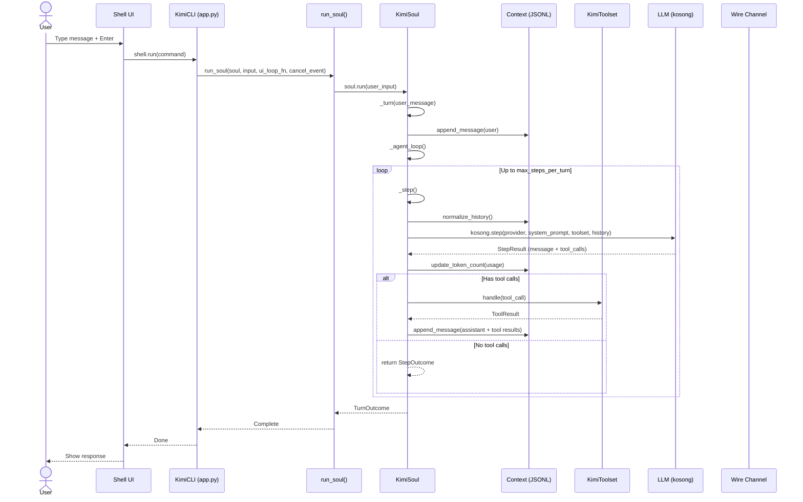
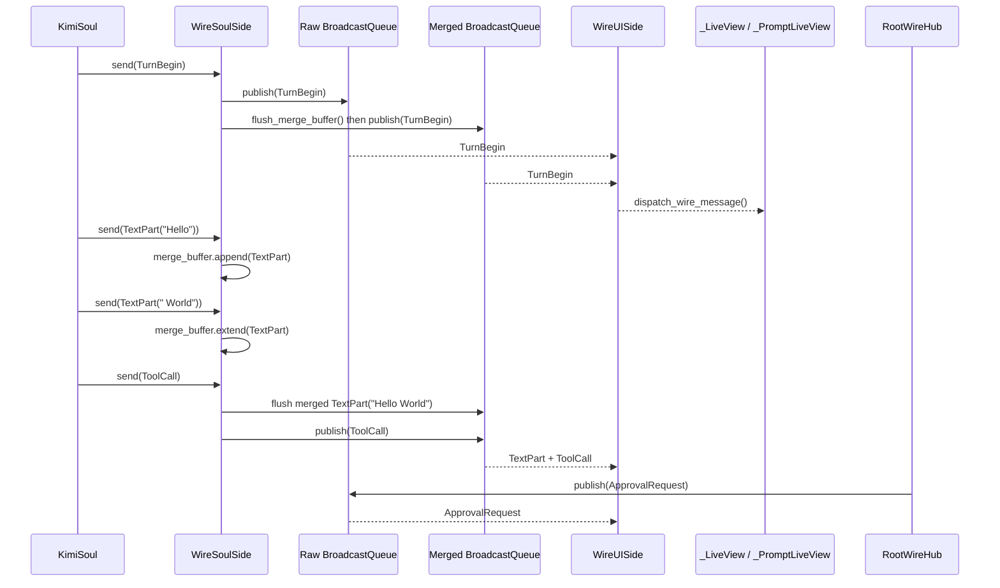
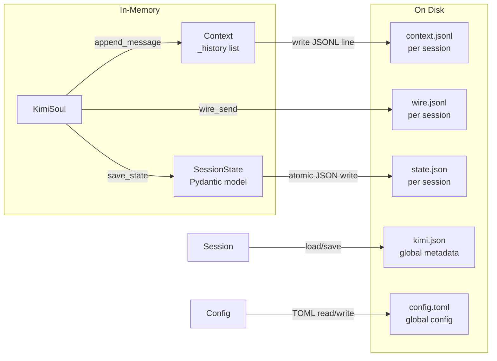
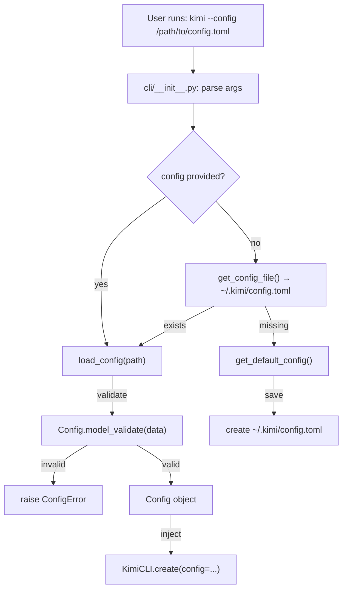
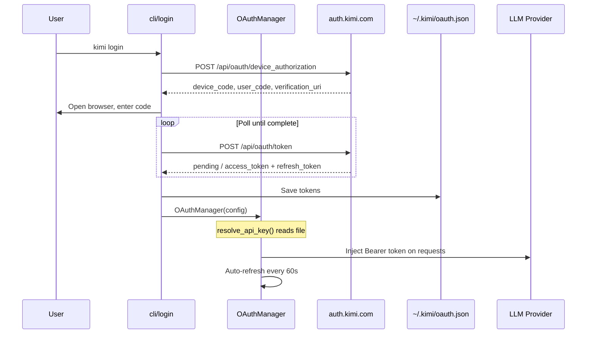
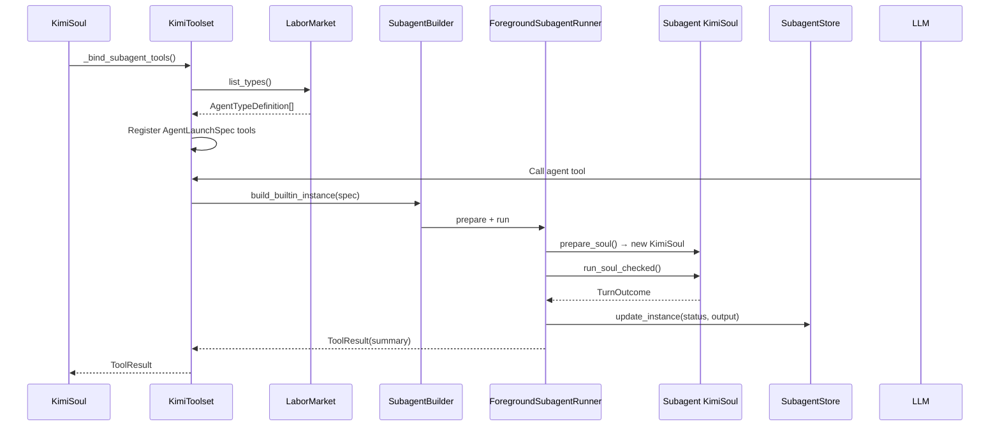

# Data Flow Diagrams

## 1. User Message to LLM Response Flow



## 2. Wire Message Data Flow



## 3. Session Persistence Data Flow



## 4. Configuration Data Flow



## 5. OAuth Token Data Flow



## 6. Background Task Data Flow

```mermaid
graph TB
    subgraph Create["Task Creation"]
        U[User sends shell command<br/>with run_in_background=true]
        T[Shell tool]
        T-->|runtime.background_tasks.create_bash_task()| M[BackgroundTaskManager]
        M-->|persist| TS[BackgroundTaskStore]
        M-->|spawn subprocess| W[Worker Process]
    end

    subgraph Monitor["Monitoring"]
        W-->|stdout/stderr| F[Task log files]
        TS-->|heartbeat updates| F2[Task state files]
    end

    subgraph Query["Query / Stop"]
        U2[User calls TaskList/TaskOutput/TaskStop]
        T2[Background tools]
        T2-->|read store + files| TS
        TS-->|return TaskView| T2
        T2-->|display| U2
    end

    subgraph Reconcile["Reconciliation"]
        KimiCLI-->|on startup| M
        M-->|scan disk + kill stale| W
    end
```

## 7. Subagent Data Flow


