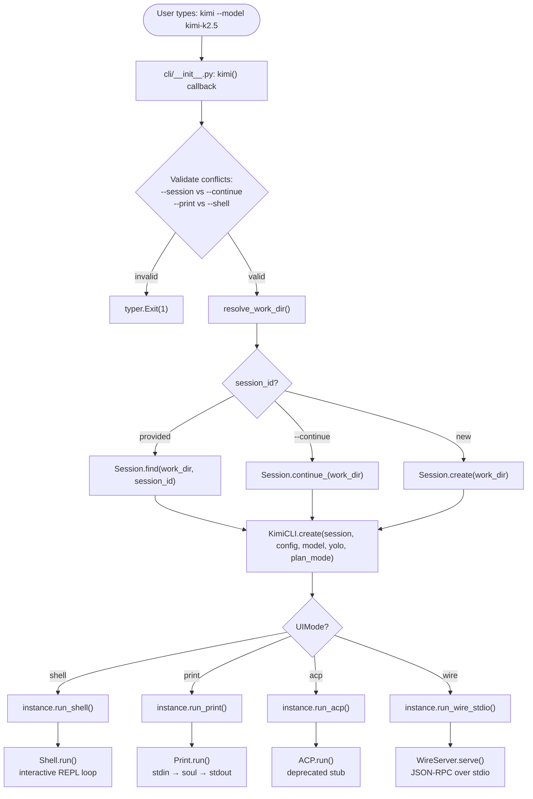
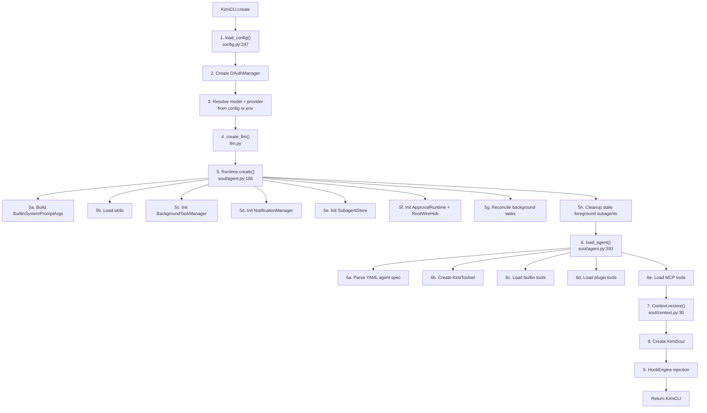
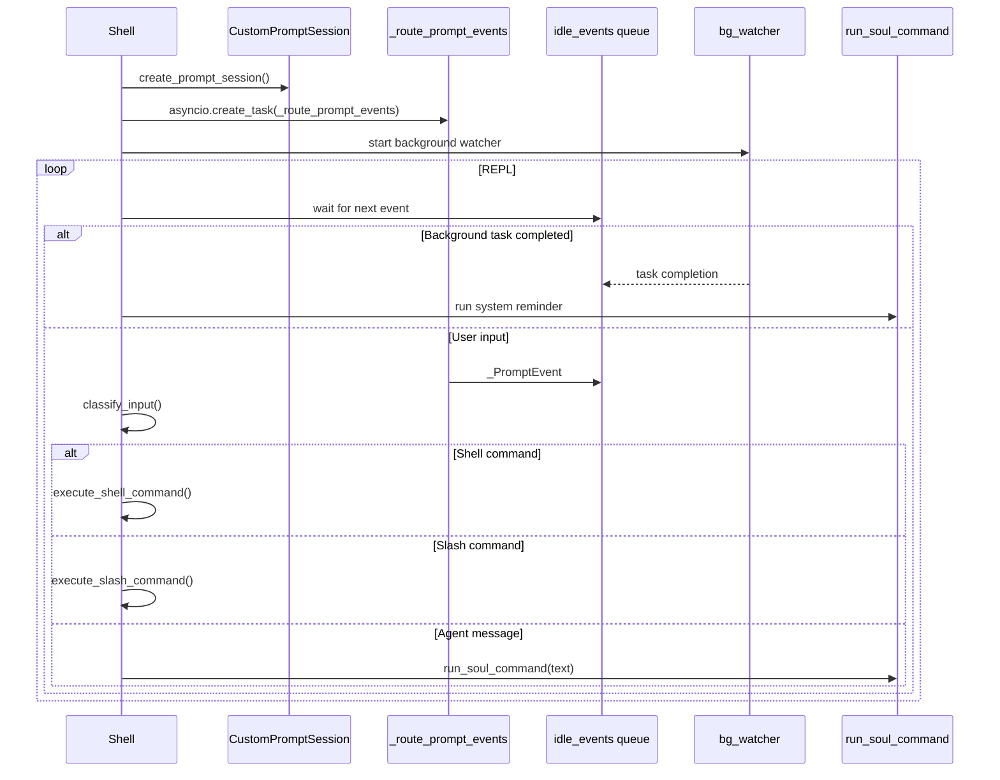
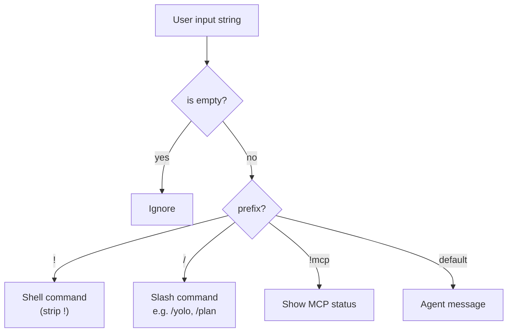
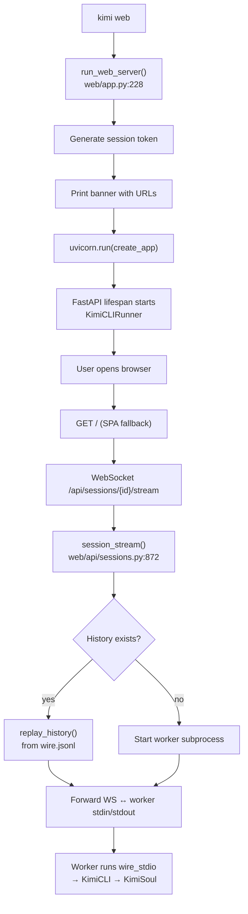
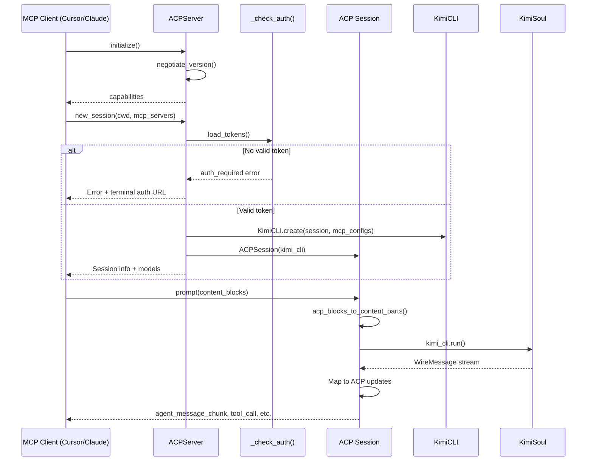

# Command Execution Flow

## 1. CLI Entry to Shell Mode

## 2. `KimiCLI.create()` Boot Sequence

## 3. Shell REPL Event Loop

## 4. Shell Input Classification

## 5. Web Mode Execution Flow

## 6. ACP Server Execution Flow

