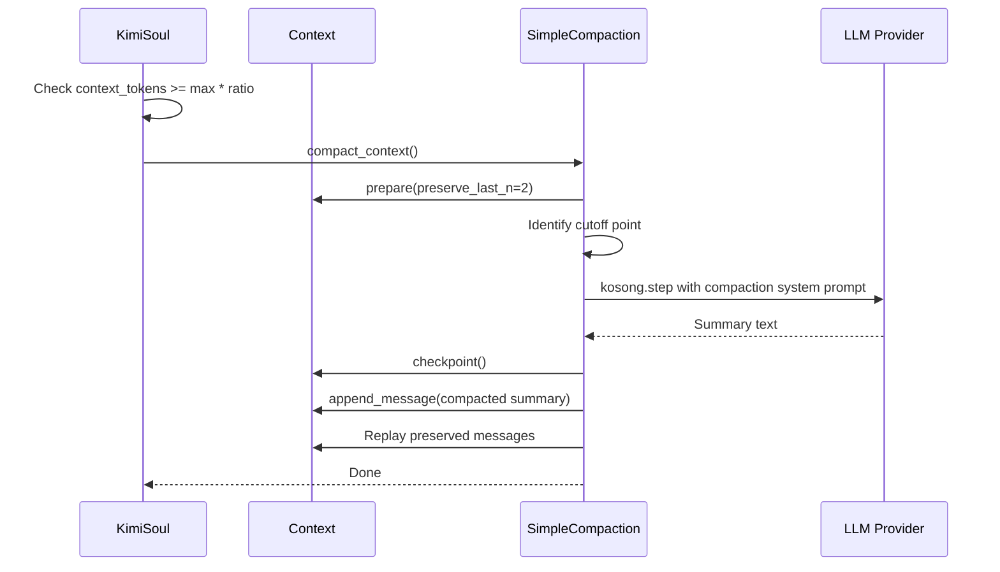
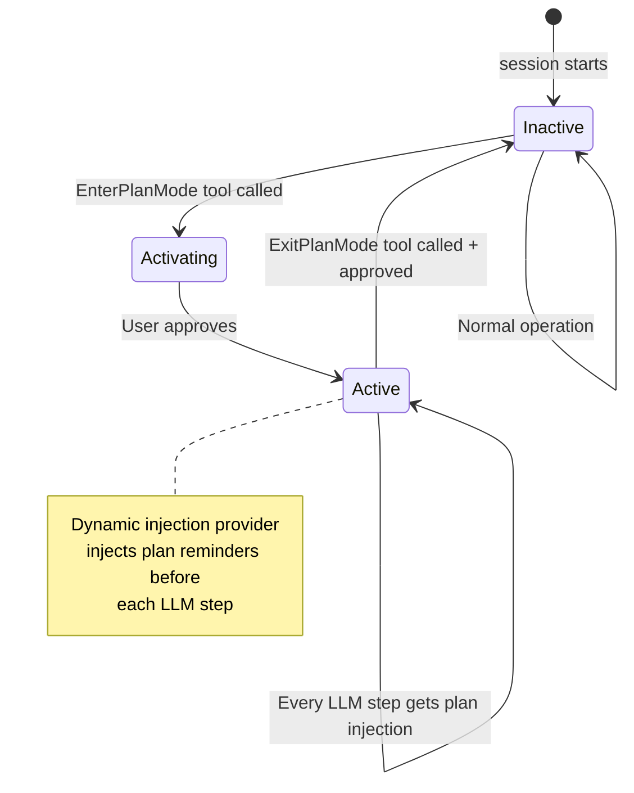
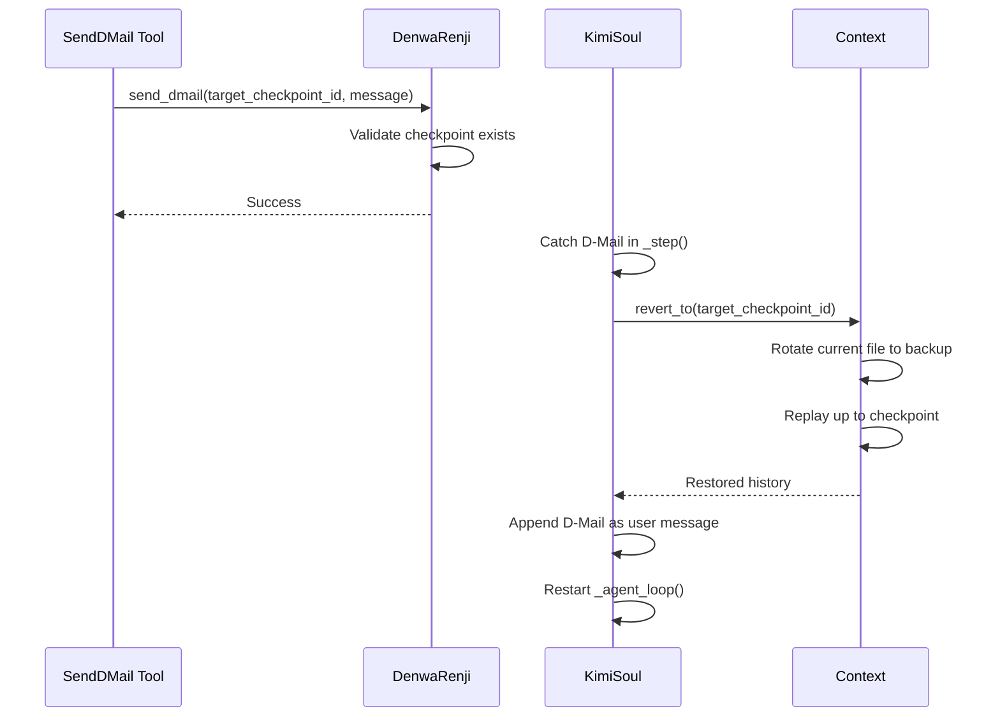

# Soul / Agent Loop Flow

## 1. KimiSoul Turn Lifecycle

```mermaid
flowchart TD
    Start([run_soul() called]) --> TurnBegin["KimiSoul.run()
soul/kimisoul.py:464"]
    TurnBegin --> Hooks["UserPromptSubmit hook
block?"]
    Hooks -->|blocked| BlockedTurn["Send TurnBegin
Blocked reason
TurnEnd
Return"]
    Hooks -->|allowed| CheckSlash{"Slash command?"}
    CheckSlash -->|yes| SlashDispatch["Dispatch to
SlashCommand handler"]
    CheckSlash -->|no| CheckRalph{"Ralph mode?
max_ralph_iterations != 0"}
    CheckRalph -->|yes| RalphLoop["FlowRunner.loop()"]
    CheckRalph -->|no| NormalTurn["_turn(user_message)"]
    NormalTurn --> AgentLoop["_agent_loop()"]
    AgentLoop --> StepLoop["For step in 1..max_steps_per_turn"]
    StepLoop --> StepBegin["Send StepBegin wire msg"]
    StepBegin --> CompactCheck{"Context > trigger?"}
    CompactCheck -->|yes| Compact["compact_context()
CompactionBegin/End"]
    CompactCheck -->|no| StepExec["_step()"]
    Compact --> StepExec
    StepExec --> Outcome{"Outcome?"}
    Outcome -->|continue| StepLoop
    Outcome -->|stop| TurnEnd["Send TurnEnd wire msg"]
    TurnEnd --> ReturnTurn["Return TurnOutcome"]
```

## 2. Single Step Internal Flow

```mermaid
flowchart TD
    A[_step()] --> B["Deliver pending notifications
(if root role)"]
    B --> C["Collect dynamic injections
PlanMode / YoloMode"]
    C --> D["normalize_history()"]
    D --> E["kosong.step(
  provider,
  system_prompt,
  toolset,
  history
)"]
    E --> F["Retry on retryable errors
(tenacity)"]
    F --> G["Log token usage
Update context token count"]
    G --> H["Wait for tool results
result.tool_results()"]
    H --> I["_grow_context()"]
    I --> J{"Rejection without feedback?"}
    J -->|yes| K["Stop turn
return StepOutcome(stop)"]
    J -->|no| L{"DenwaRenji D-Mail?"}
    L -->|yes| M["Raise BackToTheFuture
Revert context"]
    L -->|no| N{"Has tool calls?"}
    N -->|yes| O["return None (continue loop)"]
    N -->|no| P["return StepOutcome(no_tool_calls)"]
```

## 3. Context Compaction Flow



## 4. Plan Mode State Machine



## 5. DenwaRenji (Time Travel) Flow


