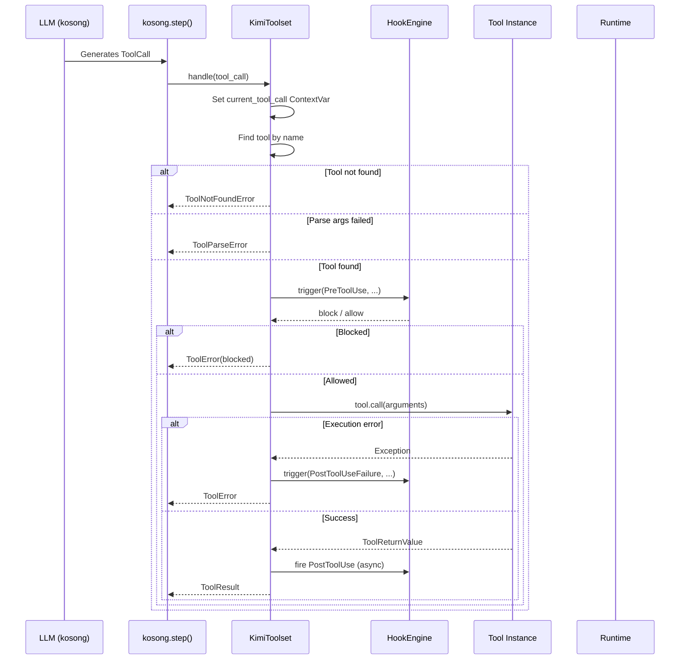
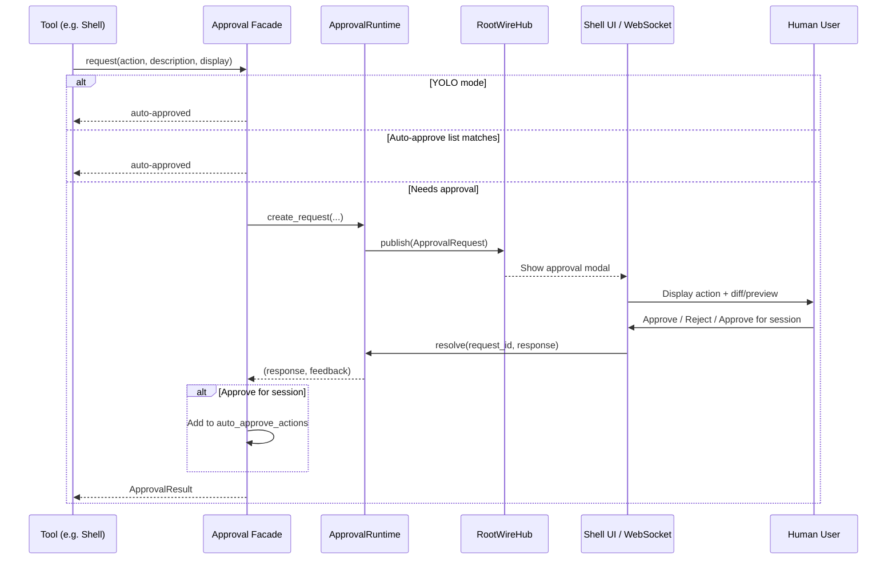
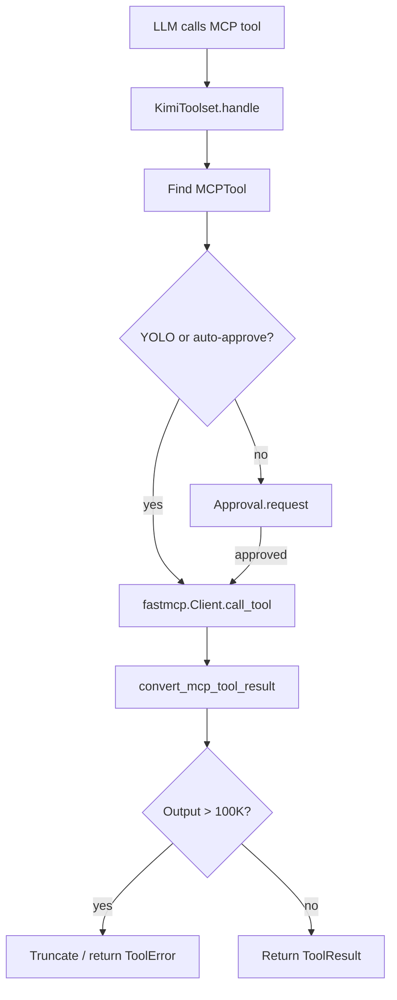
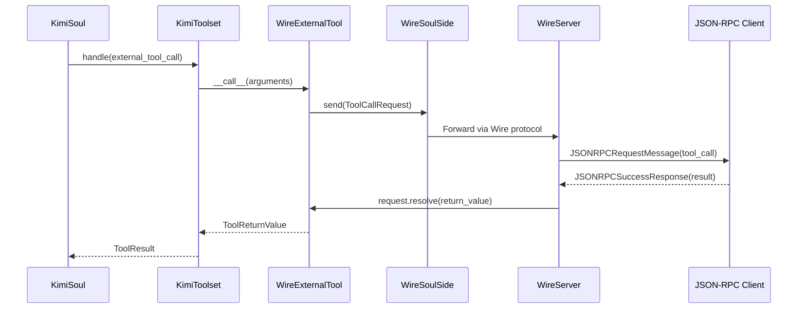
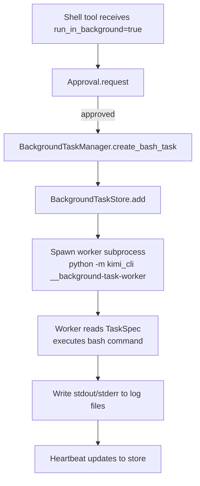
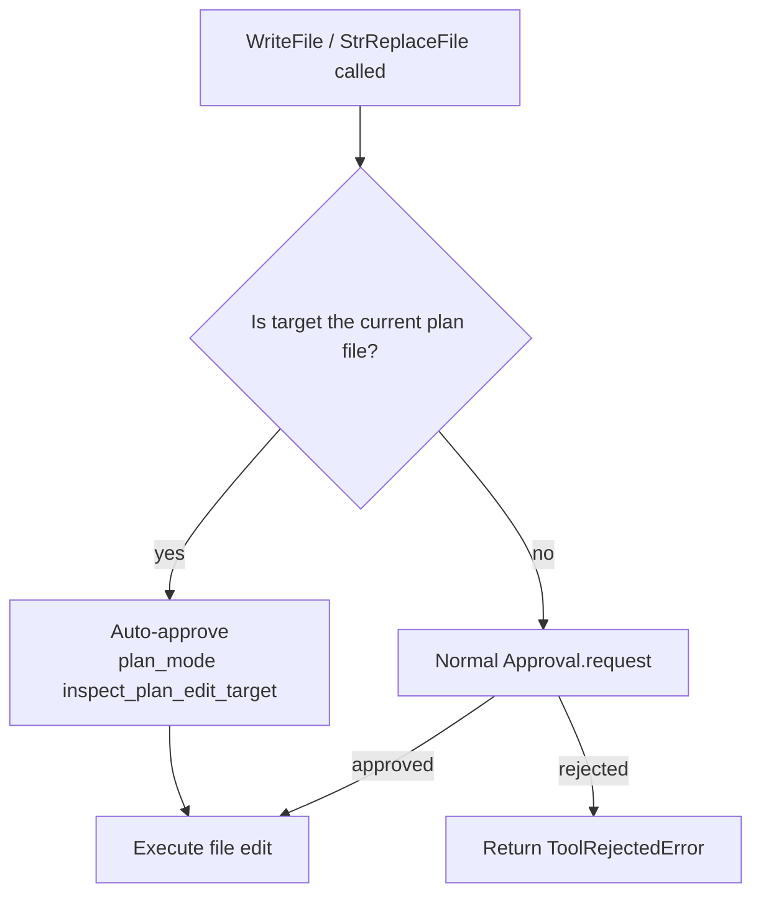

# Tool Execution and Approval Flow

## 1. Tool Invocation Sequence

## 2. Approval Flow (Foreground Tool)

## 3. MCP Tool Execution Flow

## 4. External Tool (Wire) Execution Flow

## 5. Background Shell Task Creation Flow

## 6. File Edit Tool Approval Exception (Plan Mode)

