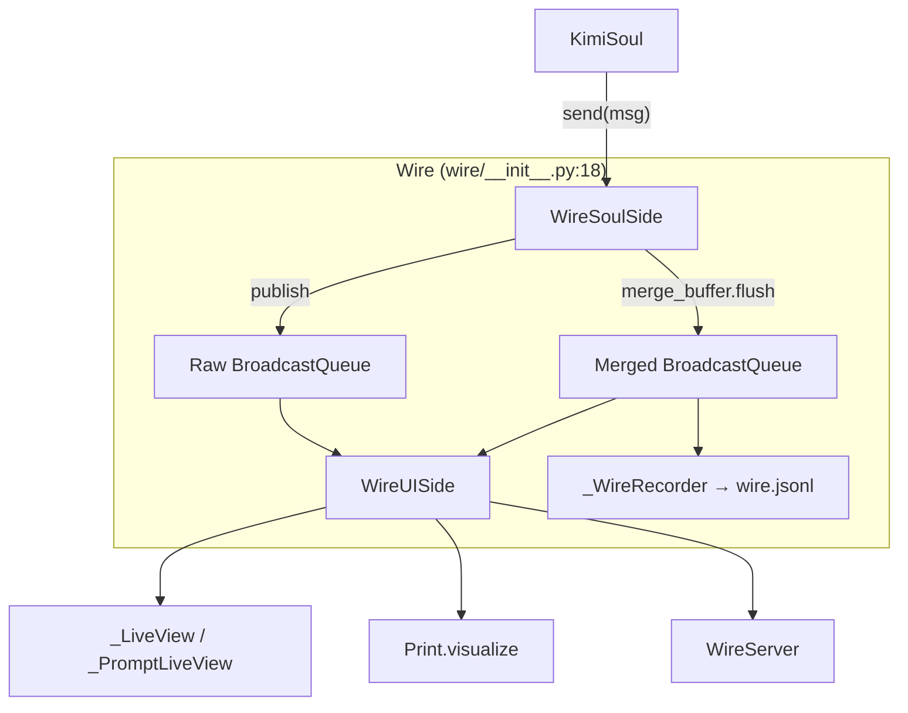
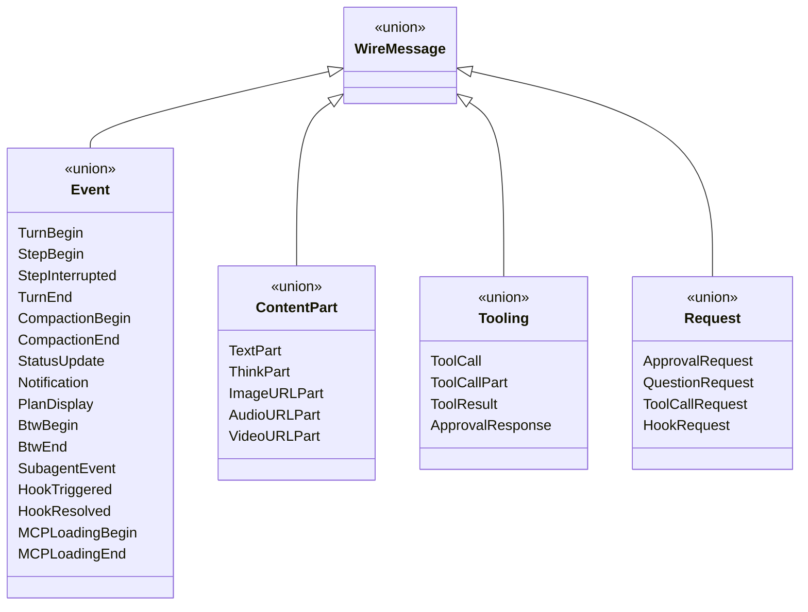
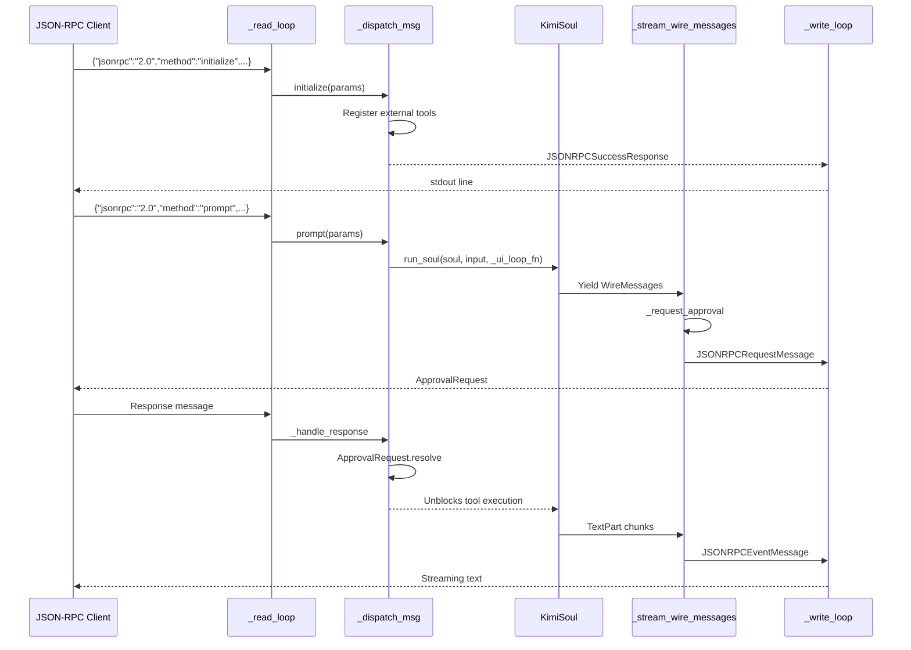
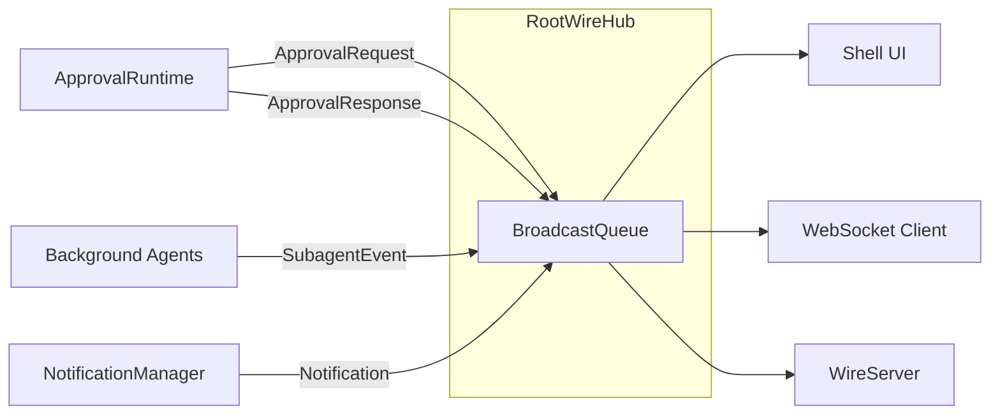

# Wire Protocol Architecture

## 1. Wire Channel Structure



## 2. Wire Message Type Hierarchy



## 3. JSON-RPC Bridge Message Flow



## 4. RootWireHub Broadcast Model



## 5. WireServer Inbound Methods

| JSON-RPC Method | Handler | Purpose |
|-----------------|---------|---------|
| `initialize` | `_handle_initialize` | Register external tools, hooks, capabilities |
| `prompt` | `_handle_prompt` | Start a new soul turn |
| `steer` | `_handle_steer` | Inject follow-up input into running turn |
| `replay` | `_handle_replay` | Replay persisted wire file messages |
| `set_plan_mode` | `_handle_set_plan_mode` | Toggle plan mode |
| `cancel` | `_handle_cancel` | Cancel current turn |
| *(response)* | `_handle_response` | Resolve pending approval/question/tool/hook requests |

## 6. Wire File Persistence Format

```
~/.kimi/sessions/<hash>/<session_id>/wire.jsonl

{"v":1,"created_at":<timestamp>}
{"type":"TurnBegin","payload":{...}}
{"type":"ContentPart.TextPart","payload":{"text":"Hello"}}
{"type":"ToolCall","payload":{"tool_call_id":"...",...}}
{"type":"ToolResult","payload":{"tool_call_id":"...",...}}
{"type":"TurnEnd","payload":{"stop_reason":"no_tool_calls"}}
```
