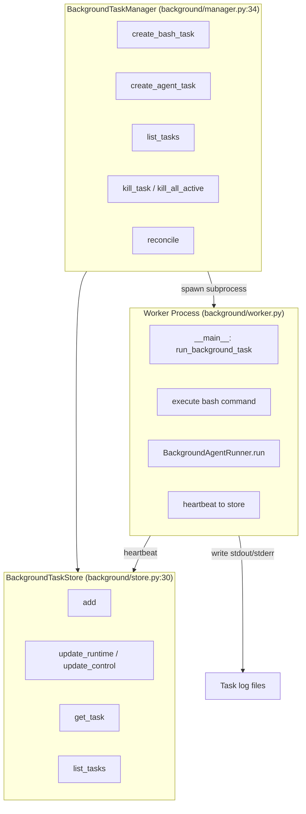
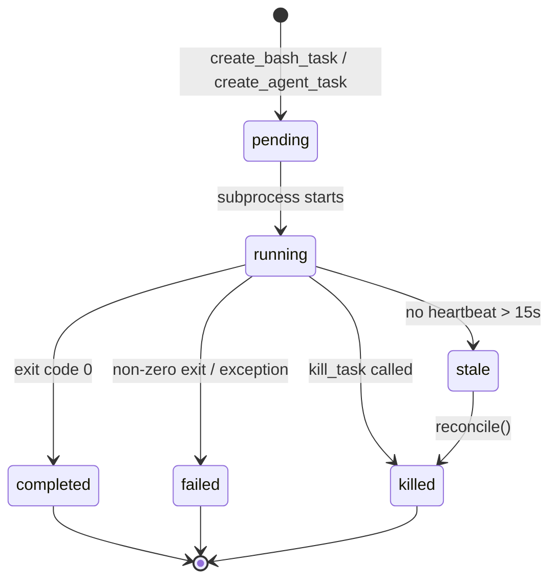
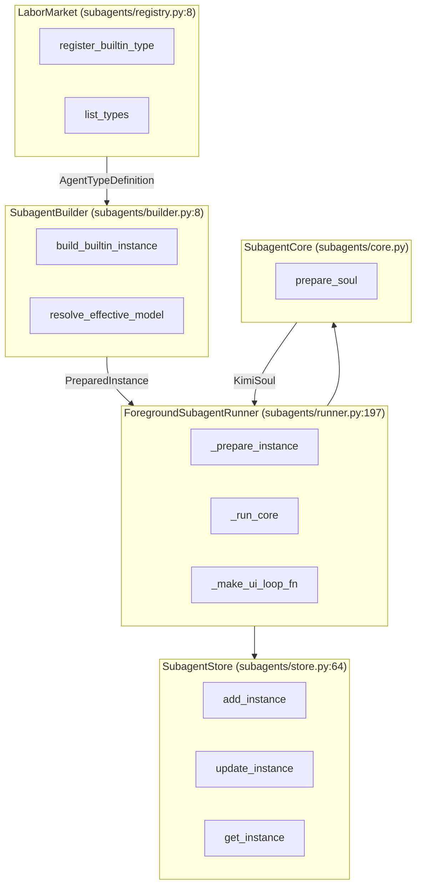
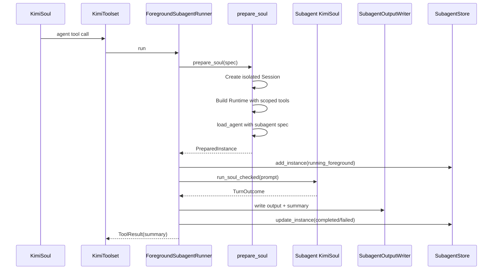
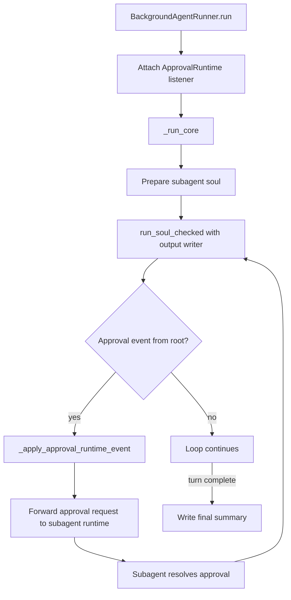
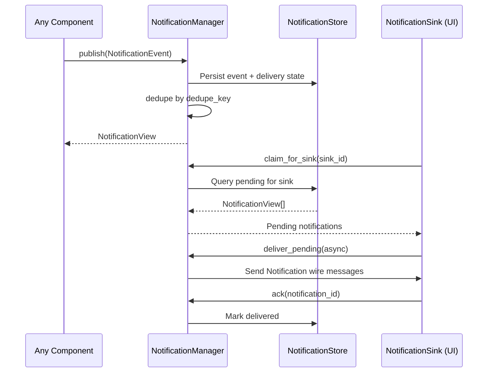
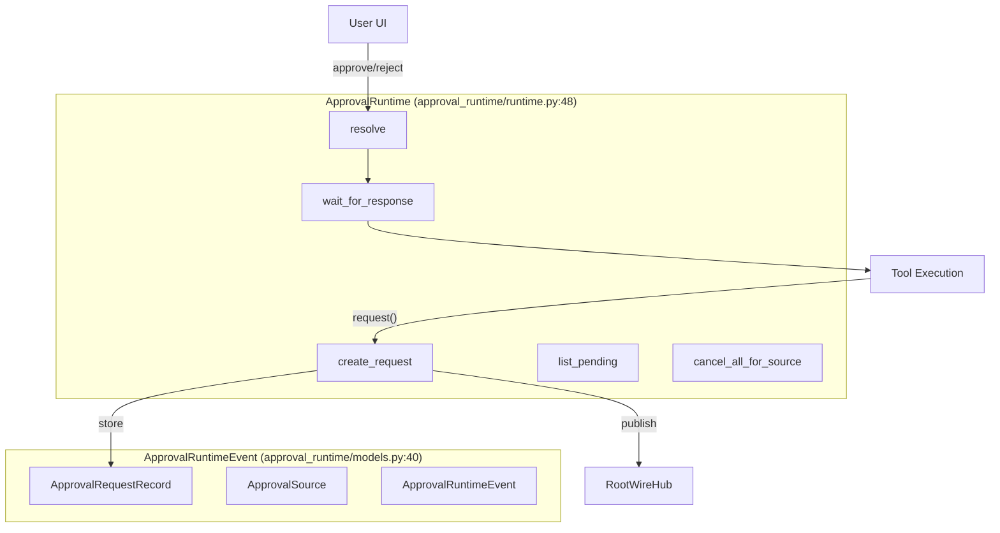

# Background Tasks and Subagents Architecture

## 1. Background Task Manager

## 2. Background Task Lifecycle

## 3. Subagent Architecture

## 4. Foreground Subagent Execution Flow

## 5. Background Agent Runner Flow

## 6. Notification System Flow

## 7. Approval Runtime Architecture

