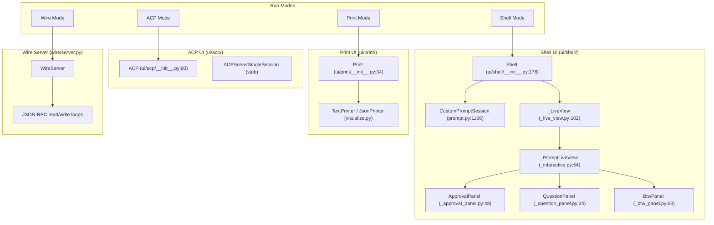
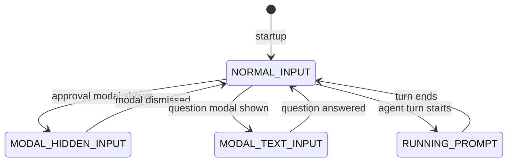
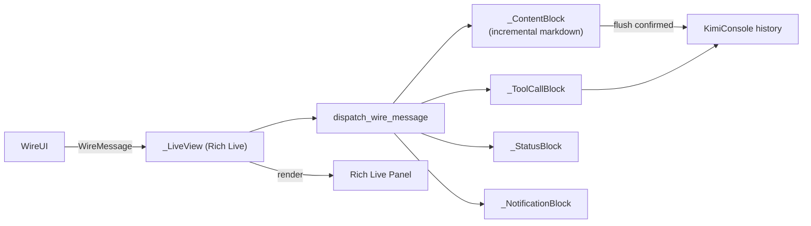
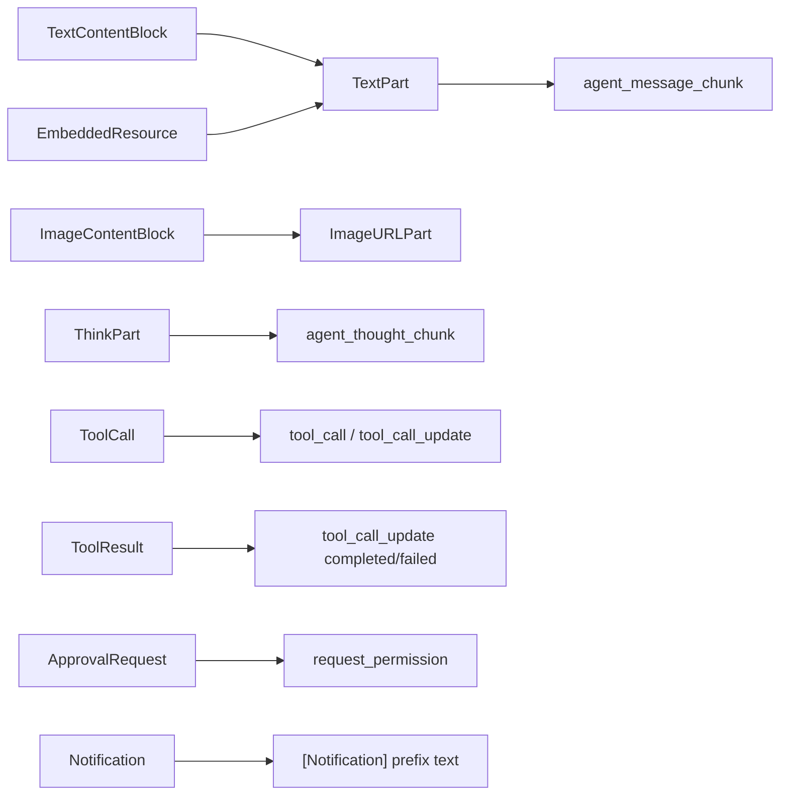

# UI Layer Architecture

## 1. UI Mode Hierarchy



## 2. Interactive Shell Event Loop

```mermaid
flowchart TD
    Start([Shell.run()]) --> Init["1. Create CustomPromptSession
2. Start _route_prompt_events task
3. Start bg_watcher"]
    Init --> Loop["while True"]
    Loop --> Wait["bg_watcher.wait_for_next(idle_events)"]
    Wait --> Result{"Event type?"}
    Result -->|input| Classify["classify_input()"]
    Classify -->|agent msg| RunSoul["run_soul_command(text)"]
    Classify -->|slash cmd| Slash["execute_slash_command()"]
    Classify -->|shell cmd| ShellCmd["execute_shell_command()"]
    Result -->|interrupt| Interrupt["Handle Ctrl+C
cancel_event.set()"]
    Result -->|background done| BgDone["run_soul_command(
<system-reminder>...)"]
    RunSoul --> Viz["visualize(wire.ui_side)"]
    Viz --> Live["_PromptLiveView"]
    Live --> Render["dispatch_wire_message()"]
    Render --> Blocks["Update _ContentBlock / _ToolCallBlock"]
    RunSoul -->|complete| Loop
```

## 3. Prompt Toolkit UI State Machine



## 4. Live View Rendering Pipeline



## 5. Print Mode Flow

```mermaid
flowchart TD
    A[Print.run] --> B{"command provided?"}
    B -->|no| C["Read stdin if piped"]
    B -->|yes| D[Use command]
    C --> E[run_soul(input, visualize)]
    D --> E
    E --> F[visualize(wire, output_format)]
    F --> G{"output_format?"}
    G -->|text| H[TextPrinter]
    G -->|stream-json| I[JsonPrinter]
    H --> J[rich.print to stdout]
    I --> K[json.dumps to stdout]
```

## 6. ACP to Internal Wire Mapping


